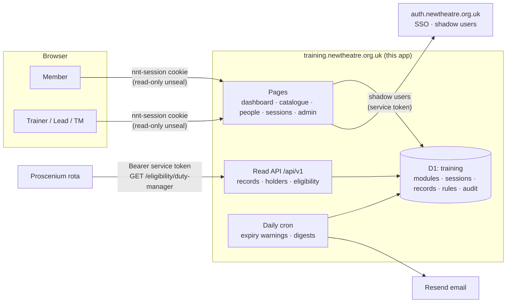

# Architecture

How the training system works and why it looks the way it does. Individual decisions: [decisions/](decisions/). This doc is the assembled picture.

## Context

The estate is small Nuxt 4 apps on Cloudflare Workers, each with its own D1 database, sharing one identity via the auth service's sealed-cookie SSO. The legacy training site was a Django 1.11 app on Heroku, stale since 2019: public records, no expiry concept, no API, unmaintainable stack. Meanwhile the backstage subcommittee designed a new module/certification scheme (the `DEPT-LCT` catalogue), and the Proscenium FOH rota design committed to deriving duty-manager eligibility "from the planned training system via its API".

Goals: one source of truth for training under the new scheme; configurable expiry; session-based audit trail; a secure read API; retire Heroku. Non-goals (v1): scheduling/sign-ups (designed for v2, [roadmap](roadmap.md)), hosting training materials (Drive links only), public pages, full history import.

## The one-diagram version

## Components

**Pages** (`app/pages/`): dashboard (`/`), catalogue (`/modules`), people directory (`/people`), session logging (`/sessions`), admin (`/admin`). All behind a global fail-closed auth middleware; the only unauthenticated surface is the health endpoint and the login redirect. Full page inventory: [permissions.md](permissions.md#pages).

**Record engine** (`server/utils/`): `validity.ts` (the single validity implementation, CLAUDE.md invariant 4), `records.ts` (creation with expiry stamping), `eligibility.ts` (rule evaluation). Everything else calls these; nothing reimplements them.

**Read API** (`server/api/v1/`): service-token-authenticated JSON, read-only. Reference: [api-reference.md](api-reference.md); consumer guide: [consuming-the-api.md](consuming-the-api.md).

**Cron** (`server/tasks/expiry-sweep.ts`, daily 06:00 UTC): computes state transitions, sends member warnings and monthly digests via Resend, writes `notification_log`. Ships in dry-run mode ([operations.md](operations.md#notifications)).

**Database** (D1 `training`, Drizzle): [data-model.md](data-model.md).

## Key flows

**Log a session**, trainer (valid `grants_trainer` record, checked at request time) fills date / modules / attendees → confirm screen lists exactly the records to be created → one transaction inserts the session and one `SESSION` record per attendee × module, each with expiry stamped per [records-and-expiry.md](records-and-expiry.md). Prerequisite gaps warn but don't block (safety-critical modules: hard block, trainer-overridable). Unknown attendee → add-by-email → auth shadow endpoint → mirror upsert → record attaches to the canonical id.

**Sign off a certification**: lead (for that department) or admin, on the person's page → server re-checks every prerequisite record is VALID/EXPIRING (invariant 5) → `SIGNOFF` record created, `granted_by` recorded, audit-logged.

**Answer an eligibility query**: consumer calls `GET /api/v1/eligibility/duty-manager?userId=…` → rule loaded from `eligibility_rules` → each required module's current record evaluated through the validity util → `{ eligible, missing, expiring }`. The rule is data; enforcement belongs to the consumer ([ADR-0006](decisions/0006-eligibility-rules-as-data.md)).

**Expire**: nothing happens in the database. A record's state changes because today's date moved past its stamped `expires_at`; the cron merely *notices* (for emails); every read derives the same answer.

## Trust boundaries

| Boundary | Mechanism |
|---|---|
| Browser ↔ app | Shared sealed cookie (auth service is the only writer); global fail-closed middleware |
| Member ↔ privileged UI | Ability layer: `training:ADMIN` role (staleness-checked per the session contract) + `department_leads` + derived trainer standing |
| Consumer app ↔ API | Per-consumer bearer token, hashed at rest, constant-time compare, read-only scope |
| This app ↔ auth service | Outbound service token for shadow-user creation; inbound GDPR hooks authenticated by the same token ([gdpr-retention.md](gdpr-retention.md)) |
| Cron ↔ members | Email only; the cron can never mutate records (CLAUDE.md invariant 10) |

## What lives where

This app owns training: the catalogue (content stewarded by the subcommittee through the admin UI), sessions, records, eligibility rules, training audit. The auth service owns identity. Consumer apps own what they do with eligibility answers. Drive owns training materials: every module carries a `materials_url`, and permissions on those Drive files are managed in Drive, per the estate's Drive structure doc.
